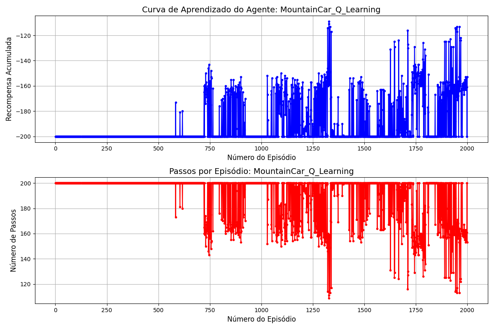
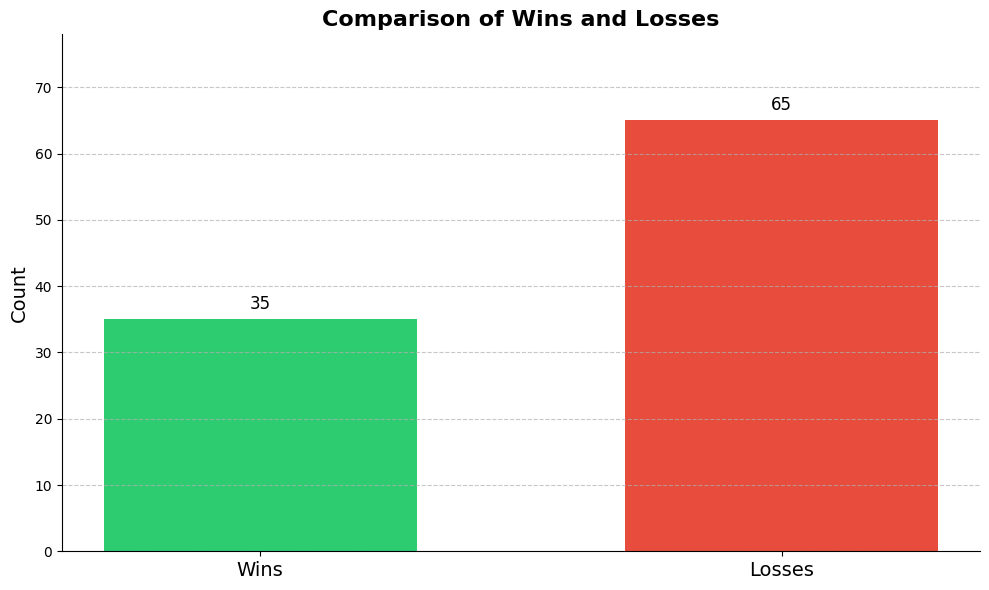

# Reinforcement-Learning-Mountain-Car

## O aprendizado do agente converge rapidamente? Fica estável?

Ao analisar a recompensa acumulada e a quantidade de passos por episódio não fica claro um convergência rápida ou estável.

Tem uma maior tendência de resultados bons (maior frequência de picos) quanto mais episódios, mas não é estável ou fica claro uam convergência

## Que indicador é importante utilizar para avaliar se o agente está alcançando o objetivo?

É importante testar o agente no ambiente e calcular a quantidade de vezes em que ele chegou no resultado avaliando o estado terminar e comparar com a quantidade de vezes em que o episódio foi maior que 200, resultando em truncated, onde o agente não antigiu o objetivo. 

## Depois de treinado, o agente consegue chegar ao topo em todas as vezes? Quantas ações em média são necessárias?

Após o meu treinamento, testei 100 vezes e em 35% o agente consegui chegar no resultando enquanto em 65% ele falhou